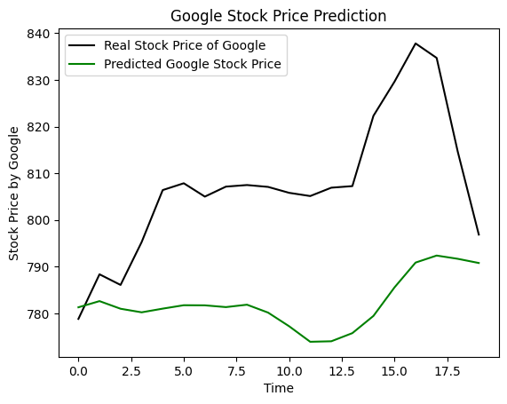

# Google Stock Predictor using LSTM

This project uses Long Short-Term Memory (LSTM) neural networks to predict the stock price trends of Google. The model is trained on historical stock price data to forecast future price movements.

## Project Overview
The goal of this project is to predict upward or downward trends in Google's stock prices using LSTM, a type of recurrent neural network known for its effectiveness in time series forecasting.

## Dataset
The model is trained using the dataset:
- **Google_Stock_Price_Train.csv**: Contains historical stock prices from 2010 to 2023.

## Features
- Data normalization using Min-Max Scaling.
- LSTM model architecture for sequential learning.
- Visualization of predicted vs. actual stock prices.

## Dependencies
- Python (NumPy, Pandas, Matplotlib)
- Scikit-learn (for data preprocessing)
- TensorFlow/Keras (for LSTM implementation)

## Getting Started
1. Clone this repository:
    ```bash
    git clone <[repository_url](https://github.com/whatsroopalupto/Stock_Price_Prediction)>
    ```
2. Install the required dependencies:
    ```bash
    pip install numpy pandas matplotlib scikit-learn tensorflow keras
    ```
3. Place all the Dataset in your directory
4. Run the Jupyter Notebook:
    ```bash
    jupyter notebook Stock_Price_Predictor.ipynb
    ```


## Results
The model visualizes the predicted stock price trends compared to actual prices, enabling an analysis of its forecasting accuracy.

### Sample Output


## Future Improvements
- Incorporate additional features like trading volume and other financial indicators.
- Experiment with different model architectures and hyperparameters.

## License
This project is licensed under the MIT License.

## License
This project is licensed under the MIT License.
